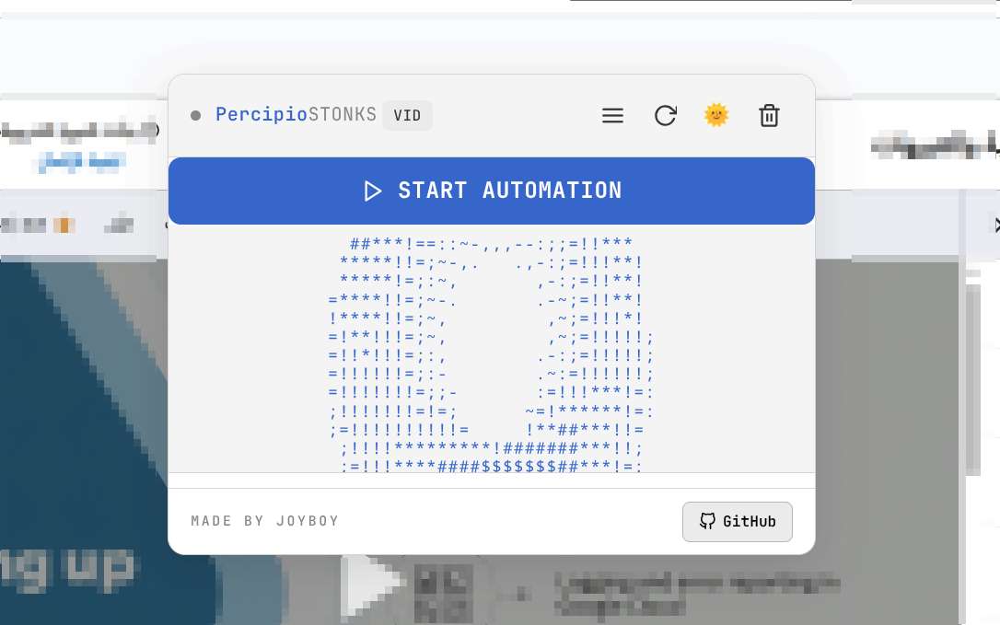
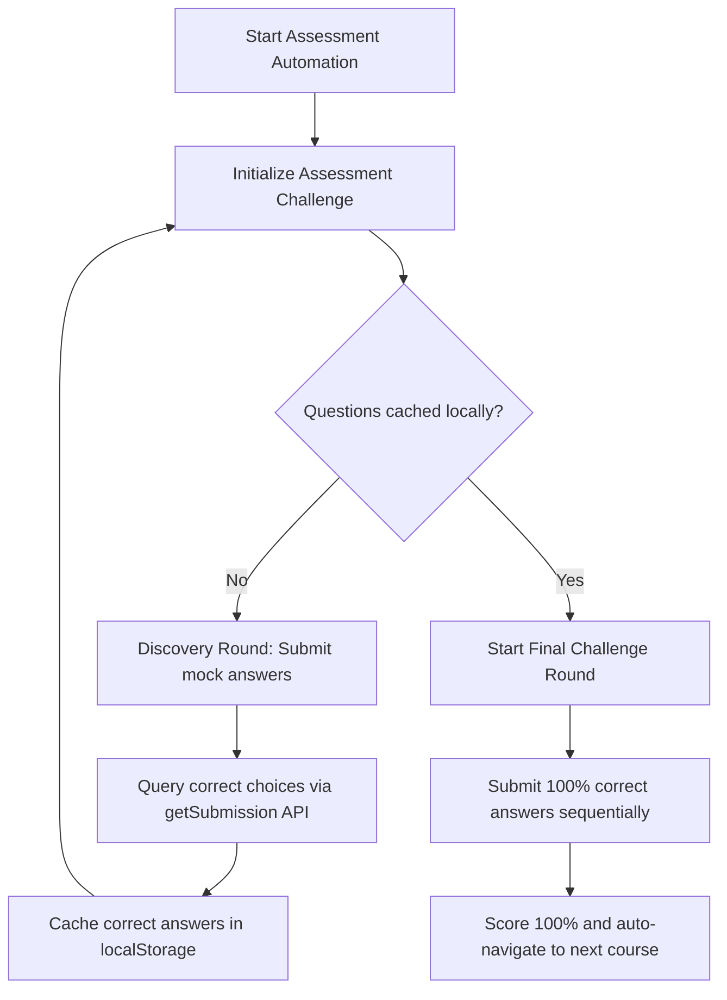

<h1 align="center">🧠 Percipio Stonks</h1>

<p align="center">
  
</p>

<p align="center">
  <b>Ultimate browser extension to automate and expedite course completion on Percipio.</b><br>
  Marks videos as watched · Bypasses knowledge checks · Instantly solves assessments via GraphQL exploits.
</p>

<p align="center">
  <a href="https://github.com/np4abdou1/percipio-stonks"></a>
  
  
  
</p>

---

## 🎨 Interface Showcase

<p align="center">
  
</p>

---

## 📋 Table of Contents

- [Features](#-features)
- [How It Works](#-how-it-works)
- [Installation](#-installation)
- [Usage Guide](#-usage-guide)
- [Keyboard Controls](#-keyboard-controls)
- [Troubleshooting](#-troubleshooting)
- [License](#-license)

---

## 🚀 Features

| Mode | Target Pages | Automation Action |
|:---|:---|:---|
| **Videos / Resources** | `/videos/`, `/courses/<id>` | Marks all video content and files as completed directly via Percipio's internal APIs. |
| **Knowledge Check** | `/knowledgeCheck/` | Queries and submits the exact correct responses instantly using Percipio's private GraphQL/REST endpoints. |
| **Assessment (Exams)** | `/assessment/`, `/questions` | Leverages a zero-latency discovery exploit using Percipio's GraphQL endpoint to fetch correct choices and auto-submits a perfect score. |

### Extra Quality of Life Features
- 🌓 **Adaptive Theme**: Toggle between Light and Dark mode dynamically.
- 🔄 **Draggable HUD**: Click and drag the panel header to reposition it anywhere on your screen.
- 🍩 **3D ASCII Donut**: Features a live mathematical torus animation rotating in real-time.
- 🛡️ **Fail-safe Logic**: Retries questions, auto-dismisses exit modals, and stops auto-run once a passing grade is achieved.

---

## ⚡ How It Works

No AI/LLM models or API keys are required. The assessment solver directly intercepts Percipio's GraphQL API through a two-phase process:



---

## 📦 Installation

To load the extension in developer mode, follow these steps:

1. Clone this repository locally:
   ```bash
   git clone https://github.com/np4abdou1/percipio-stonks.git
   cd percipio-stonks
   ```
2. Open your chromium-based browser (Chrome, Edge, Brave, Opera) and navigate to `chrome://extensions`.
3. Toggle the **Developer mode** switch in the top-right corner.
4. Click the **Load unpacked** button in the top-left corner.
5. Select the repository root folder (`percipio-stonks`).

---

## 🎮 Usage Guide

1. Navigate to any Percipio course page.
2. Click the **START AUTOMATION** button.
3. The extension will automatically transition between sections:
   - Mark videos as watched
   - Bypassing Knowledge Checks
   - Solving assessments
   - Navigating to the next course in the learning path.

---

## ⌨️ Keyboard Controls

Press <kbd>Ctrl</kbd> + <kbd>Shift</kbd> + <kbd>P</kbd> to force-reinitialize the workspace environment, or use the HUD controls below:

- <kbd>☰</kbd> Collapse or expand the interface panel.
- <kbd>↻</kbd> Re-scan current active webpage context.
- <kbd>☀</kbd> / <kbd>☾</kbd> Switch theme palette.
- <kbd>🗑</kbd> Clear execution log messages.

---

## 🔧 Troubleshooting

<details>
<summary><b>Click to expand troubleshooting steps</b></summary>

### 1. Extension context invalidated
If you update or reload the extension while on an open Percipio tab, you must refresh the tab to establish a connection to the new service worker.

### 2. Missing authorization tokens
The solver relies on your active browser session (`id_token` in `localStorage`). Ensure you are logged into your organization's Percipio platform before initiating automation.

### 3. Exit modal loops
The extension automatically hooks and cancels confirmation popups asking if you want to abort the exam. If blocked, click once inside the page canvas to focus.

</details>

---

## 📜 License

```
MIT License - Copyright (c) 2026 Joyboy & np4abdou1
```

---

<p align="center">
  MADE BY JOYBOY
</p>
